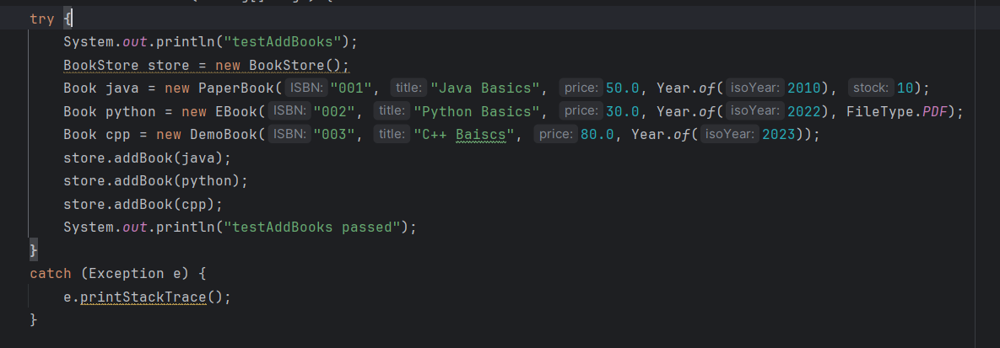
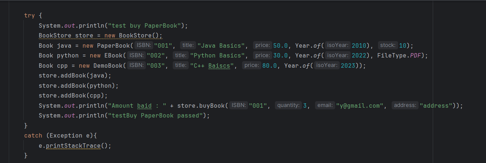
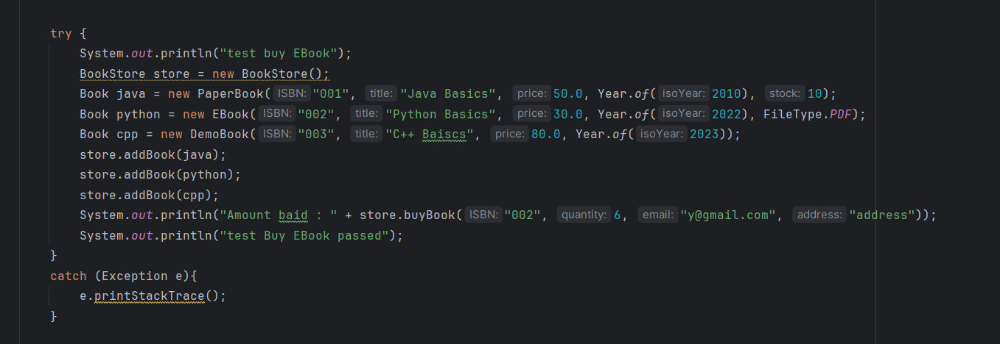
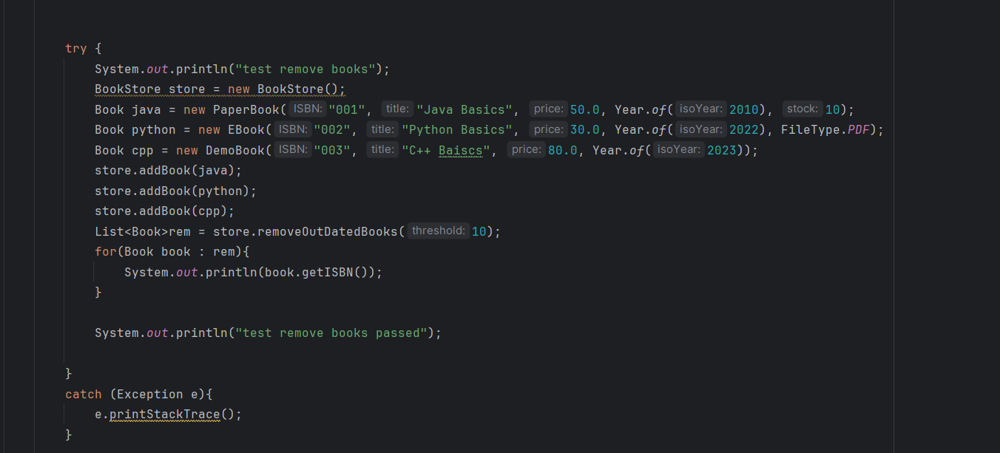
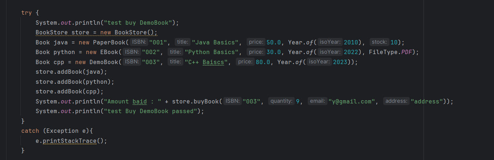
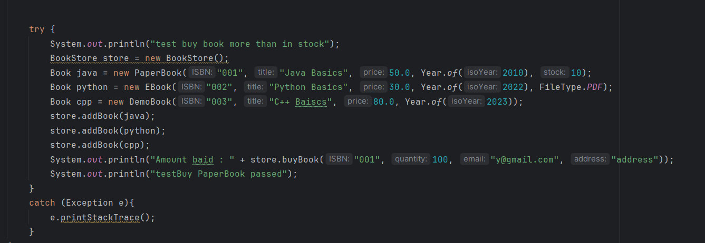
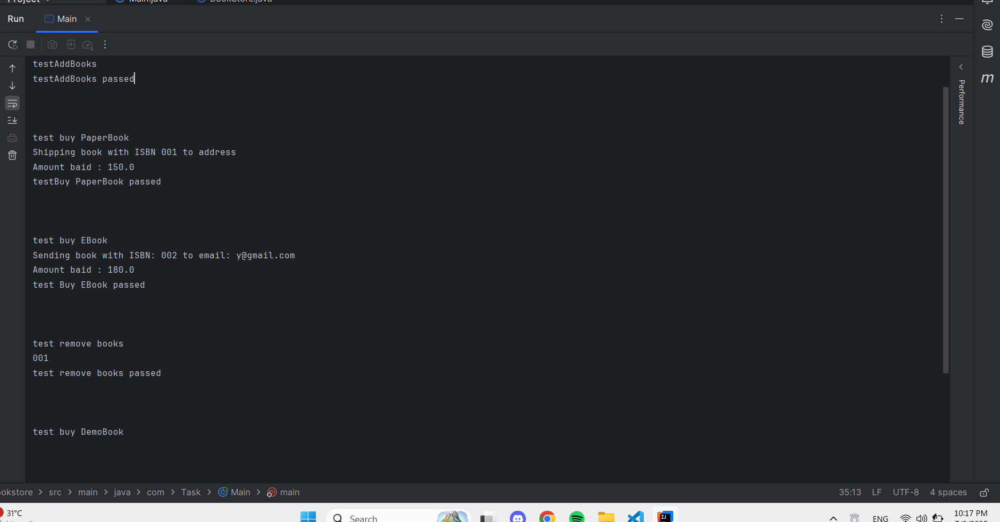
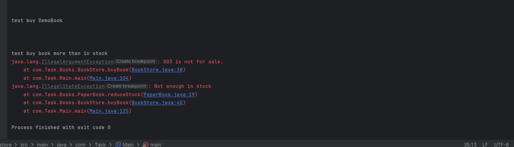

# 📘 Quantum Book Store

Welcome to **Quantum Book Store**, an online bookstore application that supports different types of books such as paper books, eBooks, and demo/showcase books.

---

##  Features

-  Manage inventory of:
  - **Paper books** (with stock & shipping)
  - **eBooks** (with file type & sent via email)
  - **Demo/Showcase books** (not for sale)
-  Add, remove, and list books
-  Email functionality for sending eBooks
-  Automatically remove outdated books
-  Object-Oriented Design using Inheritance

---

##  Project Structure

```
Bookstore/
├── src/
│   ├── model/           # Book classes (PaperBook, EBook, DemoBook)
│   ├── service/         # Services like Email, Inventory
│   └── Main.java        # Application entry point
├── test/                # Unit tests
└── README.md
```

---

##  Technologies Used

- Java
- IntelliJ IDEA

---


## Test Cases

### ✅ Add Books Test


---

### ✅ Buy Paper Book Test


---

### ✅ Buy EBook Test


---

### ✅ Remove Books Test


---

### ✅ Buy Demo Book Test


---

### ✅ Buy More Than The Stock Test


---

### Output Of All Tests In Arrange
  



## How to Run

1. Clone the repo:
   ```bash
   git clone https://github.com/Yousseff-2/BookStore.git
   cd BookStore
   ```

2. Open the project in **IntelliJ IDEA**

3. Build and run `Main.java` from the `src` directory

---


